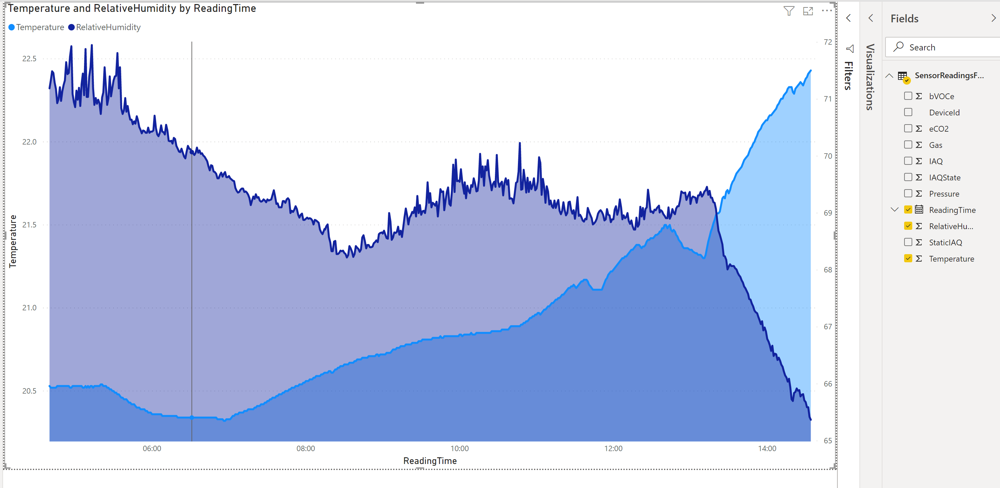

# Using the BME680 sensor in a Raspberry Pi Zero connected to Microsoft Azure

This is a sample of using the Bosch BME680 sensor connected to a Raspberry Pi Zero and uploading/processing data in Azure. I'm using Adafruit's breakout (https://www.adafruit.com/product/3660) and using it to gather information including temperature, humidity and air quality.

*Note: This project is Work in Progress as of 23/06/2020. I'm actively working on it and will be adding often. Next step is an Android app to do visualization.*

## Architecture

The process is divided in these steps:

1. **Pi Zero**: get readings from the sensor every 3 seconds and write a CSV file to the file system
    - *Note*: as per various sources on the web, the frequency of readings seems to have an effect in the Gas reading values, due to the way the MOX sensor works, hence the short interval. (see here https://www.adafruit.com/product/3660 and https://cdn-shop.adafruit.com/product-files/3660/BME680.pdf and https://forums.pimoroni.com/t/bme680-observed-gas-ohms-readings/6608/5 for more information)
2. **Pi Zero**: a cron job calling a Python script regularly wakes up and pushes up the files to Azure IoT Hub in cronological order
    - While this may seem inneficient vis-a-vis sending up the readings directly, I've actually found that having the readings as files helped me overcome development-time issues while setting up the processing in Azure, or situations where for some reason wifi drops or some kind of anomaly happens. Unless this is not at all possible, I'd also resort to this design in a production system.

3. **Azure**: data is received in an Azure IoT Hub

4. **Azure**: an Azure Stream Analytics job picks up data from the IoT Hub and pushes the readings into an Azure SQL Database
    - Raw data is stored as "Bronze", filtered/aggregated as "Silver"
    - Further processing is done to aggregate and remove peaks, for Silver data

5. **PowerPI** is used to do visualizations on the data read from the Azure SQL Database. - I already have this working in a simple form.

6. **Android App** to do visualization and record events (e.g., opening a window has a major effect on the readings, after a few minutes). This will be a separate GitHub project.

This is the big picture overview as of writing. I've noticed from data I've already gathered that there are both "bad readings" (reported by the sensor) that have to be ignored, and anomalies that have to either removed from the data or smoothed out. I'll add steps above (probably in Stream Analytics) to handle these.

**TBD** - do an architecture diagram

### Note on reading data from sensor

Bosch has a library (compiled C) to handle their BME680 sensor, including proprietary code to calculate the Interior Air Quality (IAQ) score adjusting for humidity/pressure. The fact that they are the makers of the sensor and that the calculations done are unknown (it's close code) led me to decide to not use Adafruit's (https://github.com/adafruit/Adafruit_BME680) nor Pimoroni's (https://github.com/pimoroni/bme680-python/) libraries to get readings. You can however simply use either of the above libraries with the Adafruit breakout, both work - Pimoroni's seems more refined, but they're not Bosch's.

## Base setup instructions (if you're starting from scratch)

Start by following these instructions to set up the Zero: [1 - Basic Device setup](DeviceSetup.md). After this, you'll need to install some additional libraries in the device, related either to the BME680 sensor or to Azure. To do this, follow the steps here: [2 - Libraries setup](BME680Setup.md). When you finish these two, you'll have a C application compiled that prints out the sensor's readings to the screen, and all the required dependencies for what follows. Finally, you need to do the [3 - Azure IoT setup](AzureSetup.md).

## Get formatted sensor readings and push them to Azure

After the previously steps are done, you'll need to make some modifications so that:

- the readings are captured in a format simple to process in Azure (I picked CSV, but JSON would be another good option)
- run code to send the readings to an Azure IoT Hub.

To do this, follow steps [4 - Save and upload readings](DeviceUploadData.md).

## Process the incoming data in Azure

The desired processing steps over the incoming data stream are essentially filtering and aggregation. I store the "bronze" data (i.e. data as is received without any changes) in a table, and then do filtering/aggregation and store this in another table. I decided to aggregate/average every 30 seconds but can have more aggregations by simply adding its configuration.

For this processing I'm using Azure Stream Analytics, and [the detail of what I'm doing is here](StreamProcessing.md).

## Display data

Here's a simple chart to look at Temperature and Humidity, in PowerBI Desktop:

Also started working on an Android App, that's **TBD** atm.