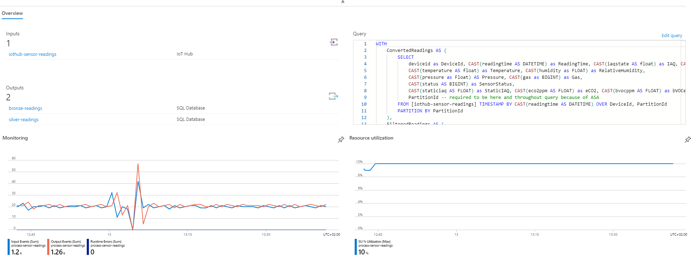
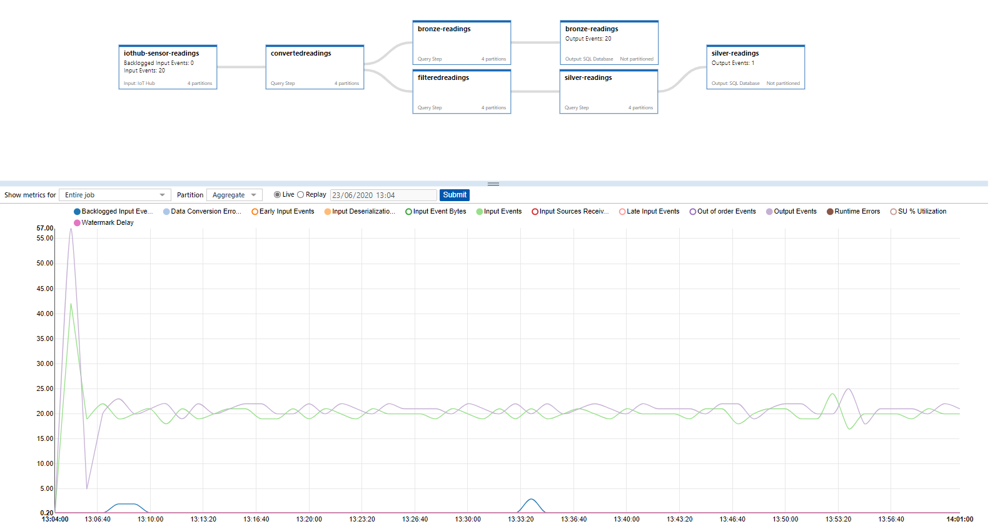
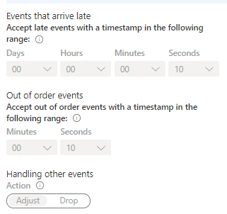

# Stream Processing of Incoming sensor telemetry

## Setup - creating output tables

I'm using [Azure SQL Database](https://docs.microsoft.com/en-us/azure/azure-sql/) (tier S2 to S4) to store this data.

1. Bronze table: `RawSensorReadings` - unchanged data, stored as is received without any processing:

```sql
SET ANSI_NULLS ON
GO
SET QUOTED_IDENTIFIER ON
GO
CREATE TABLE [dbo].[RawSensorReadings](
	[DeviceId] [varchar](255) NOT NULL,
	[ReadingTime] [datetime] NOT NULL,
	[IAQ] [float] NOT NULL,
	[IAQState] [tinyint] NOT NULL,
	[Temperature] [float] NOT NULL,
	[RelativeHumidity] [float] NOT NULL,
	[Pressure] [float] NOT NULL,
	[Gas] [int] NOT NULL,
	[SensorStatus] [smallint] NOT NULL,
	[StaticIAQ] [float] NOT NULL,
	[eCO2] [real] NOT NULL,
	[bVOCe] [real] NOT NULL
) ON [PRIMARY]
GO
```

2. Silver table: `SensorReadingsFilteredAveraged` - with some anomalies filtered out and 30 second averaging in a tumbling window:

```sql
SET ANSI_NULLS ON
GO
SET QUOTED_IDENTIFIER ON
GO
CREATE TABLE [dbo].[SensorReadingsFilteredAveraged](
	[DeviceId] [varchar](255) NOT NULL,
	[ReadingTime] [datetime] NOT NULL,
	[IAQ] [float] NOT NULL,
	[IAQState] [tinyint] NOT NULL,
	[Temperature] [float] NOT NULL,
	[RelativeHumidity] [float] NOT NULL,
	[Pressure] [float] NOT NULL,
	[Gas] [int] NOT NULL,
	[StaticIAQ] [float] NOT NULL,
	[eCO2] [real] NOT NULL,
	[bVOCe] [real] NOT NULL
) ON [PRIMARY]
GO
CREATE NONCLUSTERED INDEX [IDX_SensorReadingsFilteredAveraged_ReadingTime] ON [dbo].[SensorReadingsFilteredAveraged]
(
	[ReadingTime] ASC
)WITH (STATISTICS_NORECOMPUTE = OFF, DROP_EXISTING = OFF, ONLINE = OFF) ON [PRIMARY]
GO
```

Note the differences between the tables:

- The silver table doesn't have the SensorStatus (because all the Sensor Statuses signifiying errors have been filtered out);
- The silver table has an index on the `ReadingTime`, becasue these 2 bytes effectively serve has an Id. Remember that for a single device (which is my case) I have 1 new record every 30 seconds (24*60*2 = 2880/day).
- The values in the silver table are all averages over 30 second intervals, not direct readings from the sensor.

## Stream processing

The stream processing is done in [Azure Stream Analytics](https://docs.microsoft.com/en-us/azure/stream-analytics/) with an ASA Job:



Some relevant configuration options for the job are:

- **Error ordering**: I accept late events up to 10 seconds, out of order events up to 10 seconds, and handle other events with "Adjust" (instead of drop)
- **Error policy** (when writing to output): Retry
- **Compatibility level**: 1.2 (which should be the default, instead of 1.1)


The job has this has inputs/outputs:

- `iothub-sensor-readings` - source of data, my IoT Hub. I configured a consumer group just for my source sensor, and have it using the Messaging endpoint and the CSV format (as generated by the C code in my Raspberry);
- `bronze-readings` - data destination, simply refers to the `RawSensorReadings` table;
- `silver-readings` - data destination, simply refers to the `SensorReadingsFilteredAveraged` table;

The job that processes the data is the following:

```sql
WITH
    ConvertedReadings AS (
        SELECT
            deviceid as DeviceId, CAST(readingtime AS DATETIME) as ReadingTime, CAST(iaqstate AS float) as IAQ, CAST(iaqaccuracy AS bigint) as IAQState,
            CAST(temperature AS float) as Temperature, CAST(humidity as FLOAT) as RelativeHumidity,
            CAST(pressure as Float) AS Pressure, CAST(gas as BIGINT) as Gas, 
            CAST(status AS BIGINT) as SensorStatus,
            CAST(staticiaq AS FLOAT) as StaticIAQ, CAST(eco2ppm AS FLOAT) as eCO2, CAST(bvocppm AS FLOAT) as bVOCe,
            PartitionId -- required to be here and throughout query because of ASA
        FROM [iothub-sensor-readings] TIMESTAMP BY CAST(readingtime AS DATETIME) OVER DeviceId, PartitionId
        PARTITION BY PartitionId
    ),
    FilteredReadings AS (
        SELECT DeviceId, ReadingTime, IAQ, IAQState, Temperature, RelativeHumidity, Pressure, Gas, StaticIAQ, eCO2, bVOCe, PartitionId -- removing SensorStatus
        FROM ConvertedReadings
        PARTITION BY PartitionId
        WHERE SensorStatus = 0 AND Pressure > 800 AND Temperature BETWEEN 12 AND 26 -- filters out most common cases of wrong values, w/ exception of RelativeHumidity/Gas variations
    )

-- Bronze data
SELECT DeviceId, ReadingTime, IAQ, IAQState, Temperature, RelativeHumidity, Pressure, Gas, SensorStatus, StaticIAQ, eCO2, bVOCe -- leaving out PartitionId
INTO [bronze-readings] 
FROM ConvertedReadings
PARTITION BY PartitionId

-- Silver data: filtered and averaged and rounded
SELECT DeviceId, MAX(ReadingTime) as ReadingTime, ROUND(AVG(IAQ),2) as IAQ, cast(AVG(IAQSTATE) as BIGINT) AS IAQState, ROUND(AVG(Temperature),2) as Temperature, ROUND(AVG(RelativeHumidity),2) as RelativeHumidity, ROUND(AVG(Pressure),2) as Pressure,
       cast(AVG(Gas) as BIGINT) as Gas, ROUND(AVG(StaticIAQ),2) as StaticIAQ, ROUND(AVG(eCO2),10) as eCO2, ROUND(AVG(bVOCe),10) as bVOCe -- leaving out PartitionId
INTO [silver-readings]
FROM FilteredReadings
PARTITION BY PartitionId
GROUP BY TumblingWindow(second, 30), DeviceId, PartitionId
```

Some notes on the above:

- I have two sub-queries on the `WITH` section. 
    - The *first* does type conversation and specifies `TIMESTAMP BY`, because we want to use the `ReadingTime` as the message's timestamp, not the arrival time at the IoTHub (remember they are sent up in bulk by the `scoop_up_data.py` script every few seconds). You'll also notice the `PARTITION BY`, which is mandatory when you use `TIMESTAMP BY/OVER` -- this is also why you'll see the `PartitionId` present in the different queries ([see this for more information](https://docs.microsoft.com/en-us/stream-analytics-query/timestamp-by-azure-stream-analytics#limitations-and-restrictions)).
    - The *second* subquery does simple filtering of anomalous data based on the sensor status, pressure and temperature. These filters are pretty raw but built based on anomalies I've observed, and I'm simply dropping the entire row if one of these comes in. There are smarter ways to do this, [such as this using Machine Learning](https://docs.microsoft.com/en-us/azure/stream-analytics/stream-analytics-machine-learning-anomaly-detection). The `RelativeHumidity` occasionaly has several spikes and dips when things get unstable, averaging could be the best way to handle those (future work? :-).
- After the sub-queries, I then write the result of the first sub-query to the Bronze table (I list out all the fields because I explicitly need to leave out `PartitionId`)
- Write the result of the second sub-query to the Silver table. Again I filter out the `PartitionId` column, but more importantly apply a Tumbling window of 30 seconds (which should hold 10 readings -- the sensor writes one every 3 seconds) and average the values over that period - rouding/casting as necessary.

And that's it! After starting the job the readings started flowing into my two tables, and as a curiosity my job diagram in Stream Analytics shows:



## Word of caution

Be careful with the options you set for *Event Ordering*. I'm using this:



I actually changed from Adjust to Drop for part of the development, and noticed that even increasing the period for the Out of Order events, I'd still have nothing in the output. This was due to my mis-understanding of what was happening here and a mixup between the timestamp in the message and the `ReadingTime` column inside the received CSV. You can see more information [in the documentation page](https://docs.microsoft.com/en-us/azure/stream-analytics/event-ordering). But if you see no errors but also no outputs, check these options.

Also don't forget to add the `PARTITION BY` clause or you'll have an error such as this: `The streaming job failed: Stream Analytics job has validation errors: If TIMESTAMP BY OVER clause is used with partitioned streams, 'PartitionId' must be used as partition key. Please use \"PARTITION BY PartitionId\" clause for the input 'iothub-bme680-readings'`. You only get this when you start the job, it's not detected in the editor (unlike other errors).

## Further links

The following documentation links give additional helpful information:

- Stream data as input into Stream Analytics - https://docs.microsoft.com/en-us/azure/stream-analytics/stream-analytics-define-inputs
- Understand time handling in Azure Stream Analytics - https://docs.microsoft.com/en-us/azure/stream-analytics/stream-analytics-time-handling
- Introduction to Stream Analytics windowing functions - https://docs.microsoft.com/en-us/azure/stream-analytics/stream-analytics-window-functions
- Configuring event ordering policies for Azure Stream Analytics: https://docs.microsoft.com/en-us/azure/stream-analytics/event-ordering
- Common query patterns in Azure Stream Analytics - https://docs.microsoft.com/en-us/azure/stream-analytics/stream-analytics-stream-analytics-query-patterns#send-data-to-multiple-outputs
- New metric in Azure Stream Analytics tracks latency of your streaming pipeline - https://azure.microsoft.com/en-us/blog/new-metric-in-azure-stream-analytics-tracks-latency-of-your-streaming-pipeline/
- Anomaly detection in Azure Stream Analytics - https://docs.microsoft.com/en-us/azure/stream-analytics/stream-analytics-machine-learning-anomaly-detection
- TIMESTAMP BY (Azure Stream Analytics) - https://docs.microsoft.com/en-us/stream-analytics-query/timestamp-by-azure-stream-analytics

Some other links were helpful:

- https://www.purplefrogsystems.com/paul/2016/09/azure-stream-analytics-windowing-queries/

- https://stackoverflow.com/questions/60460530/azure-stream-analytics-query-with-tumbling-window-using-by-timestamp-works-fine

- https://stackoverflow.com/questions/38084352/in-azure-stream-analytics-query-i-am-getting-an-error-when-using-timestamp-by
